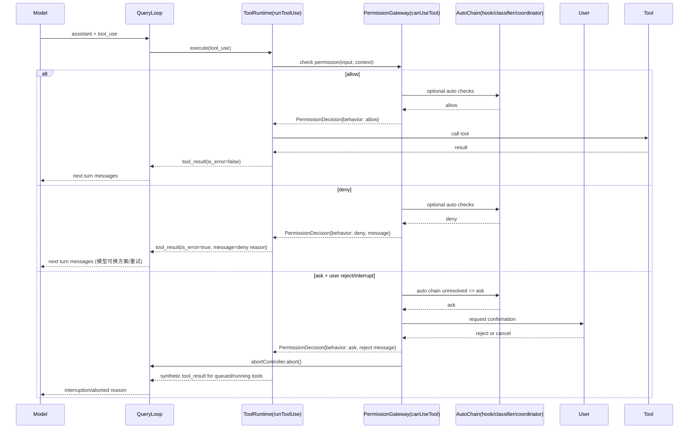

# Claude Code 架构蓝图（基于当前代码快照）

更新时间：2026-04-04  
适用范围：`/mnt/my_space/MyProject/gitee/claude-code-by-free` 当前分支快照

---

## 1. 先给结论

这套架构最值得学习的，不是“CLI 做得多全”，而是把 Agent 系统拆成了三条稳定边界：

1. `query.ts` 里的可恢复主循环（控制平面）
2. 工具执行运行时 + 权限决策（执行平面）
3. 流式 API 的故障恢复与上下文压缩（可靠性平面）

一句话概括：
**模型只负责“决策意图”，系统负责“安全执行与可恢复推进”。**

---

## 2. 架构目标（从代码反推）

从实现可以看出它追求的是以下目标：

1. 长会话可持续运行，不因上下文膨胀崩掉
2. 工具调用可并发，但状态一致性不被破坏
3. 用户中断、流式断流、工具失败后都可恢复
4. 权限默认安全，不牺牲交互效率
5. 启动快，功能多，但按路径按需加载

---

## 3. 分层蓝图（建议你照这个拆）

```text
L0 入口与启动优化
   src/entrypoints/cli.tsx
   src/main.tsx

L1 会话编排层
   src/QueryEngine.ts

L2 Agent 主循环（控制平面核心）
   src/query.ts

L3 API 流式与回退层
   src/services/api/claude.ts

L4 工具运行时层
   src/services/tools/toolOrchestration.ts
   src/services/tools/StreamingToolExecutor.ts

L5 权限决策层（安全边界）
   src/hooks/useCanUseTool.tsx

L6 工具池与扩展层
   src/tools.ts
   src/tools/*

L7 上下文与记忆层
   src/context.ts
   src/services/compact/*

L8 多智能体协调层（可选扩展）
   src/tools/AgentTool/AgentTool.tsx
   src/coordinator/coordinatorMode.ts
   src/tools/TeamCreateTool/TeamCreateTool.ts
```

设计要点：  
`L2` 不直接绑定 UI，`L4/L5` 不直接绑定模型，`L3` 不直接绑定产品场景。  
这就是可迁移性来源。

---

## 4. 最核心控制循环（你产品里必须先搭起来）

关键证据：
- `while(true)` 主循环：`src/query.ts:307`
- `tool_use` 作为后续回合触发信号：`src/query.ts:554-557`
- 工具执行入口：`src/query.ts:1380-1382`

抽象伪代码：

```ts
state = initState()

while (true) {
  prepareContext(state)              // snip/microcompact/autocompact
  stream = callModel(state.messages)
  assistant, toolUses = consume(stream)

  if (aborted) return terminal("aborted_streaming")
  if (noToolUse) return terminal("completed")

  toolResults, newCtx = executeTools(toolUses, canUseTool, context)
  if (aborted) return terminal("aborted_tools")

  attachments = collectAttachments(...)
  state.messages = merge(assistant, toolResults, attachments)
  state.context = newCtx
}
```

你要学习的不是“循环”本身，而是循环里的三件事：

1. `state` 被严格显式化（避免隐式全局状态）
2. 每次迭代都允许 `continue` 到恢复路径（而不是直接失败）
3. 终止原因是结构化的（`completed/max_turns/aborted...`）

---

## 5. QueryEngine 的准确定位

`QueryEngine` 的职责是**会话生命周期与状态封装**，不是唯一主循环实现：

- 类职责声明：`src/QueryEngine.ts:176-183`
- 一次性调用包装 `ask()`：`src/QueryEngine.ts:1184-1250`

可迁移建议：

1. 保持 `Engine` 只做会话边界、缓存、统计汇总
2. 把“推理-工具-递归”循环放在单独模块（类似 `query.ts`）
3. SDK、CLI、服务端都复用同一循环核心

---

## 6. 工具运行时设计（并发与顺序同时成立）

### 6.1 非流式工具执行编排

关键点在 `runTools`：
- 按 `isConcurrencySafe` 分批：`src/services/tools/toolOrchestration.ts:26-30`
- 并发安全批并行执行：`src/services/tools/toolOrchestration.ts:36-41`
- 非并发安全批串行执行：`src/services/tools/toolOrchestration.ts:65-71`

这套策略避免了两个常见坑：

1. 把所有工具盲目并发导致写冲突
2. 全串行导致吞吐低到不可用

### 6.2 流式工具执行器

`StreamingToolExecutor` 负责“边流式接收边执行”：
- 设计目标注释：`src/services/tools/StreamingToolExecutor.ts:35-39`
- 可丢弃失败流式批次：`src/services/tools/StreamingToolExecutor.ts:65-71`
- 为中断/回退生成 synthetic `tool_result`：`src/services/tools/StreamingToolExecutor.ts:153-205`

可迁移建议：

1. 给工具执行器建内部状态机（`queued/executing/completed/yielded`）
2. 不要让流式半途失败污染下一次重试
3. 对取消操作产出结构化“合成结果”，保持对话配对完整

---

## 7. 权限系统是“运行时闸门”，不是 UI 弹窗

关键证据：
- 决策入口：`hasPermissionsToUseTool(...)` at `src/hooks/useCanUseTool.tsx:37`
- 三分支行为：`allow / deny / ask` at `src/hooks/useCanUseTool.tsx:39`, `:65`, `:93`
- `ask` 分 coordinator/swarm/interactive 多路径：`src/hooks/useCanUseTool.tsx:95-167`

架构精髓：

1. 权限决策是工具执行协议的一部分
2. `ask` 不是简单“弹窗确认”，而是可自动化、可分布式的决策链
3. 权限失败也要回到可恢复控制流，而不是把循环打爆

你做产品时，最低要求：

1. 决策结果必须结构化（含原因、来源）
2. 每个工具都经过同一 `canUseTool` 入口
3. 拒绝/取消路径要可审计

### 7.1 权限-工具调用时序图（可直接复用）



对应代码锚点：

1. 权限检查在工具执行前触发：`src/services/tools/toolExecution.ts:916-931`
2. 非 allow 路径产出 `tool_result(is_error)`：`src/services/tools/toolExecution.ts:995-1071`
3. `ask` 不是单一路径，先走自动决策链：`src/hooks/useCanUseTool.tsx:93-167`
4. 拒绝/取消可触发 abort：`src/hooks/toolPermission/PermissionContext.ts:154-173`
5. abort 后补 synthetic `tool_result`：`src/services/tools/StreamingToolExecutor.ts:277-344`
6. 查询循环以结构化 reason 结束：`src/query.ts:1011-1052`, `src/query.ts:1484-1515`

### 7.2 最小接口与硬约束（建议直接抄）

最小接口：

```ts
type PermissionDecision =
  | { behavior: 'allow'; updatedInput?: Record<string, unknown> }
  | { behavior: 'deny'; message: string }
  | { behavior: 'ask'; message?: string; contentBlocks?: unknown[] }

type ToolResult =
  | { ok: true; tool_use_id: string; content: unknown }
  | { ok: false; tool_use_id: string; error: string; synthetic?: boolean }
```

三条硬约束：

1. 权限必须发生在 `call tool` 之前，不能后置补救。
2. 非 `allow` 也必须返回结构化 `tool_result`，不能只抛异常中断整轮。
3. 发生中断时要补齐 synthetic `tool_result`，保证 `tool_use/tool_result` 配对完整。

---

## 8. 上下文工程：不是只做 RAG，而是做“会话生存系统”

### 8.1 系统/用户上下文注入

- Git 快照一次性注入：`src/context.ts:36-111`
- 会话级缓存：`memoize` at `src/context.ts:116`, `src/context.ts:155`
- CLAUDE.md + memory 注入：`src/context.ts:170-186`

这说明它不是“每轮重算上下文”，而是“按生命周期缓存 + 必要增量更新”。

### 8.2 压缩与恢复链

`query.ts` 内的顺序是有意设计的：

1. snip：`src/query.ts:396-410`
2. microcompact：`src/query.ts:412-426`
3. context collapse：`src/query.ts:428-447`
4. autocompact：`src/query.ts:453-542`
5. reactive compact recovery：`src/query.ts:1120-1165`

可迁移建议：

1. 压缩要分层，不要一个 summarize all
2. 先便宜恢复，再昂贵恢复（先 collapse drain，再 reactive compact）
3. 恢复状态必须进入主循环状态机，而不是临时 if/else

---

## 9. API 可靠性设计：把“坏网络”当常态设计

关键证据（`src/services/api/claude.ts`）：

1. 先修复 tool_use/tool_result 配对：`1298-1302`
2. 流资源显式释放防泄漏：`1515-1525`
3. 流式空闲 watchdog：`1868-1919`
4. watchdog 触发后切非流式回退：`2308-2335`
5. 无有效事件也回退：`2337-2355`
6. 非流式 fallback with retry：`2534-2552`

可迁移建议：

1. 你必须区分“用户中断”与“系统异常”
2. 流式失败后要有非流式兜底通道
3. 所有 fallback 都要打统一可追踪事件

---

## 10. 启动架构：多入口 + 延迟加载 + 并行预热

### 10.1 入口快路径

- 动态导入策略：`src/entrypoints/cli.tsx:29-31`
- `--version` 零依赖快路径：`src/entrypoints/cli.tsx:36-42`
- 各子命令 fast-path 分流：同文件多段（如 `:95-106`, `:164-179`）

### 10.2 主程序并行预热

- 顶层并行 side-effect 注释：`src/main.tsx:1-8`
- MDM/keychain 先启动后 await：`src/main.tsx:13-20`, `:909-915`
- 启动期后台 prefetch：`src/main.tsx:2341-2375`
- MCP 与 hooks 并行：`src/main.tsx:2380-2444`

可迁移建议：

1. “首屏必需”与“首轮必需”分离
2. 预热任务可并行，但要可跳过（bare/simple）
3. 重服务调用一律延后到 trust/auth 之后

---

## 11. 工具池与扩展机制（可插拔的基础）

关键证据：
- 工具全集源头：`src/tools.ts:186-194`
- 全量基础工具组装：`src/tools.ts:193-240`
- built-in + MCP 合并入口：`src/tools.ts:330-367`

值得学习的点：

1. 工具池是集中编排的“单一事实来源”
2. MCP 与内置工具共享一套 permission deny 过滤
3. 合并时考虑 prompt cache 稳定性（不是只做 concat）

---

## 12. 多智能体是“上层能力”，不是底层耦合

关键证据：
- `AgentTool`（含 `zod/v4` schema、后台任务等）：`src/tools/AgentTool/AgentTool.tsx:6`, `:81-125`
- 协调器模式与 worker 上下文：`src/coordinator/coordinatorMode.ts:36-41`, `:80-109`
- 团队创建工具（team file/task list）：`src/tools/TeamCreateTool/TeamCreateTool.ts:74-90`, `:157-212`

架构含义：

1. 多智能体是通过工具协议挂上去的
2. 底层循环无需知道“团队语义”
3. 所以单 agent 与多 agent 共享同一运行内核

---

## 13. 你可以直接复用的产品蓝图（建议路线）

### 阶段 A：先做最小可运行内核（MVP）

1. `query loop` 状态机（含结构化 terminal reason）
2. `tool runtime`（先串行，后加并发安全分批）
3. `permission gateway`（至少 allow/deny/ask）
4. `stream -> fallback` 双通道

### 阶段 B：做可生产化

1. 上下文压缩链（snip + compact + reactive）
2. 流资源泄漏治理 + watchdog
3. tool_result 配对修复与合成错误块
4. 启动并行预热与 fast-path

### 阶段 C：做可扩展能力

1. 工具池统一编排（内置 + 外部）
2. 多智能体工具（spawn/send/stop）
3. coordinator 作为策略层，而非底层分叉

---

## 14. 反模式清单（建议避免）

1. 把主循环逻辑塞进 UI 层
2. 工具执行没有统一权限入口
3. 流式失败后直接报错退出，没有 fallback
4. 对话历史无限增长，不做分层压缩
5. 工具并发不区分读写安全
6. 中断后不补 `tool_result` 导致状态不一致

---

## 15. 评估指标（你上线前应达标）

1. `turn_success_rate`：每轮完成率
2. `tool_pairing_integrity`：`tool_use/tool_result` 配对完整率
3. `stream_fallback_recovery_rate`：流式失败后恢复率
4. `p95_first_token_latency`：首 token 延迟
5. `permission_block_rate`：权限阻断占比
6. `compaction_recovery_rate`：上下文压缩恢复成功率

---

## 16. 为什么这份蓝图“值得学”

因为它把 Agent 产品最难的三件事拆开了：

1. 推理流程如何持续推进（控制平面）
2. 工具行为如何安全落地（执行平面）
3. 异常与上下文爆炸如何可恢复（可靠性平面）

你的产品只要先把这三平面立起来，再往上叠业务能力，就不会陷入“功能越多越不稳定”的常见陷阱。
