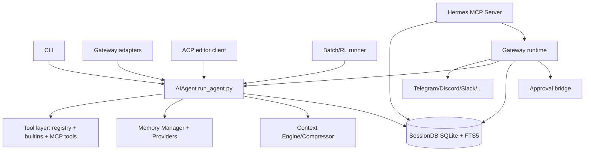

# Hermes-Agent 架构文档（代码实证版）

> 范围：`apps/bridge/temp/hermes-agent/`  
> 版本基线：`pyproject.toml` 中 `version = "0.8.0"`（`pyproject.toml:7`）  
> 目标：客观描述 Hermes-Agent 当前架构、运行机制、扩展点与工程特性。

## 1. 项目定位

Hermes-Agent 是一个“多入口 + 多运行形态 + 强工具化”的通用 Agent 框架，核心特征是：

- 一个统一核心执行器：`AIAgent`（`run_agent.py:526`）。
- 多种入口复用同一核心：
  - CLI（`cli.py`）
  - Messaging Gateway（`gateway/run.py:1`）
  - ACP（编辑器协议）（`acp_adapter/session.py:1`）
  - MCP Server（把 Hermes 对外暴露为 MCP）（`mcp_serve.py:1`）
  - Batch / RL 训练工作流（`batch_runner.py:1`, `rl_cli.py:1`）
- 强状态化与可检索会话存储：SQLite + FTS5（`hermes_state.py:1`）。

## 2. 总体架构拓扑

## 3. 运行时分层

### 3.1 核心执行层：`AIAgent`

`AIAgent` 在初始化阶段装配主要子系统（`run_agent.py:1040-1403`）：

- 会话与持久化（`session_id`, `session_log_file`, `SessionDB`）
- 工具体系与可用工具集合
- 记忆系统（内建 memory + 外部 provider）
- 上下文管理引擎（默认 `ContextCompressor`，可替换）
- Token/成本统计、provider 运行参数

主循环入口为 `run_conversation()`（`run_agent.py:7674`），关键流程：

1. 输入清洗、重试状态重置、任务隔离 id 生成（`run_agent.py:7716-7739`）。  
2. 会话历史装配、系统提示词缓存/复用（`run_agent.py:7777-7868`）。  
3. 预压缩检查（大上下文先压缩再请求 API，`run_agent.py:7870-7927`）。  
4. 预取上下文（memory/provider/plugin），注入 API 请求副本（`run_agent.py:7983-8082`）。  
5. API 调用 + 工具循环（并发/串行 tool call，`run_agent.py:6833`, `6930`, `7136`）。  
6. 结果落库、状态回调、流式/中间态回传。

### 3.2 多入口层

- Gateway：负责多平台消息接入、session key 管理、流式中间态转发、审批桥接（`gateway/run.py:1`, `7760-8125`）。
- ACP：给 IDE 用的会话管理器，支持恢复、fork、跨重启持久化（`acp_adapter/session.py:1-8`, `94-206`, `333-405`）。
- MCP Serve：Hermes 自身作为 MCP Server 暴露会话/事件/审批工具（`mcp_serve.py:1-14`, `431-829`）。
- Batch/RL：面向离线批处理和 RL 训练任务（`batch_runner.py:1-21`, `rl_cli.py:1-20`）。

## 4. 数据与状态层（SQLite + FTS5）

`SessionDB` 是状态主干（`hermes_state.py:1-15`），核心设计：

- `sessions` + `messages` 结构化存储（`hermes_state.py:41-91`）。
- `messages_fts` 虚拟表 + trigger 同步（`hermes_state.py:93-112`）。
- WAL 模式 + 应用层 jitter 重试写入，降低锁竞争（`hermes_state.py:123-214`）。
- 支持 lineage：`parent_session_id` 连接压缩分裂后的会话（`hermes_state.py:48`, `68`）。
- 提供全文检索与上下文片段返回（`search_messages`，`hermes_state.py:990-1091`）。

### 4.1 检索安全与健壮性

- FTS 查询输入清洗（`_sanitize_fts5_query`，`hermes_state.py:937-989`）。
- 对异常 FTS 语法容错返回空，避免炸进程（`hermes_state.py:1062-1065`）。

## 5. 上下文管理（Context Engine + 压缩）

Hermes 把“上下文接近上限”视为一等机制：

- 可插拔 `ContextEngine` 抽象（`agent/context_engine.py:1-26`, `32-184`）。
- 默认 `ContextCompressor` 执行：
  - 工具结果预裁剪
  - 头尾保护
  - 中间摘要
  - 摘要注入与工具对齐清洗（`agent/context_compressor.py:666-818`）。

`run_agent` 会按 `context.engine` 配置选择引擎，不存在则回退 compressor（`run_agent.py:1289-1332`）。

压缩触发后会进行“会话分裂”并写 `parent_session_id`，保持 lineage 可追踪（`run_agent.py:6719-6783`）。

## 6. 工具体系（内建 + MCP 动态工具）

### 6.1 统一注册中心

`tools/registry.py` 是单一真源（`tools/registry.py:1-15`）：

- 模块级注册（`register`，`59-94`）
- 统一 schema 导出（`get_definitions`，`116-143`）
- 统一 dispatch（`149-167`）
- 支持动态 `deregister`（`95-111`）

### 6.2 MCP 客户端接入（Hermes 调外部 MCP Server）

`tools/mcp_tool.py` 支持：

- stdio/HTTP transport（`mcp_tool.py:3-7`, `46-53`）
- 独立后台事件循环 + 线程安全管理（`55-69`）
- 动态 `tools/list_changed` 刷新（`757-822`）
- include/exclude 工具过滤、冲突保护、自动 toolset 注入（`1734-1846`）

这是 Hermes “工具面可热更新”的关键能力之一。

## 7. 安全与审批子系统

`tools/approval.py` 统一了命令安全守卫（`approval.py:1-9`）：

- 危险命令模式检测（`DANGEROUS_PATTERNS`，`75-133`）
- 多线程/多会话审批状态管理（`199-204`）
- 模式：`manual` / `smart` / `off`（`517-520`）
- Smart approval（辅助 LLM 评估，`531-580`）
- Gateway 阻塞队列审批（`793-872`）

`terminal_tool` 在执行前调用统一 guard（`terminal_tool.py:141-151`），形成“工具执行前置安全闸”。

## 8. Gateway 架构（消息平台运行态）

`gateway/run.py` 负责整机编排：

- 环境/配置桥接、平台适配器启动（`1-14`, `77-260`）
- 按 session 复用/创建 `AIAgent`，并设置每回合 callback（`7860-7917`）
- 流式 token + interim commentary 消费（`7781-7852`）
- 审批请求 UI 转换（按钮或文本）与 `/approve` `/deny` 命令处理（`6366-6462`, `8018-8079`）

### 8.1 会话主键与上下文模型

`gateway/session.py` 定义 `SessionSource`/`SessionContext`，并通过 `build_session_key()` 规范不同平台/DM/群组/线程的会话隔离策略（`session.py:66-205`, `436-493`）。

### 8.2 渠道目录缓存

`gateway/channel_directory.py` 定时构建可达渠道目录并落盘，供发送工具解析目标（`channel_directory.py:1-7`, `60-100`）。

## 9. 记忆系统（Memory Manager + Provider）

### 9.1 Provider 抽象

`agent/memory_provider.py` 定义统一生命周期：`initialize`、`prefetch`、`sync_turn`、`tool schemas`、`shutdown`（`memory_provider.py:16-31`, `52-141`）。

### 9.2 管理器编排

`agent/memory_manager.py` 特点：

- 永远保留内建 provider，最多一个外部 provider（`1-10`, `86-109`）
- 记忆内容 fence 包裹，避免当作用户输入（`54-69`）
- 跨 provider 聚合 prefetch/sync/tool routing（`167-257`）

## 10. ACP（编辑器协议）架构

ACP 的会话管理器 `acp_adapter/session.py`：

- 每个 ACP session 绑定 `AIAgent` 与 cwd（`58-69`）
- 会话创建/获取/删除/fork（`94-206`）
- 通过共享 SessionDB 持久化与恢复（`1-8`, `300-331`, `333-405`）

对应使用文档在 `docs/acp-setup.md`（`1-220`），明确说明与 CLI 共用 `~/.hermes` 配置与状态。

## 11. Hermes 作为 MCP Server（对外服务模式）

`mcp_serve.py` 提供一组会话桥工具（`1-14`, `431-829`），包括：

- `conversations_list`, `conversation_get`, `messages_read`
- `events_poll`, `events_wait`
- `messages_send`, `channels_list`
- `permissions_list_open`, `permissions_respond`

并用 `EventBridge` 轮询 SessionDB，将消息/审批事件转为 MCP 可消费事件流（`225-301`, `313-425`）。

## 12. 模型与 Provider 路由机制

`run_agent.py` 中既支持多 provider，也包含 API 形态切换逻辑：

- OpenAI/OpenRouter/Anthropic 等差异化参数处理（例如 max tokens 参数差异，`run_agent.py:1885-1894`）
- codex responses/chat mode 的前置处理与兼容路径（`run_agent.py:8229-8231` 等）
- 内置连接健康检查与重试路径，尽量从 transient 失败中恢复（`run_agent.py:7743-7755`, `8207-8225`）

## 13. 并发、可靠性与运行保障

关键工程机制：

- SQLite 写冲突的应用层退避重试（`hermes_state.py:123-214`）
- 工具调用支持并发执行（`_execute_tool_calls_concurrent`，`run_agent.py:6930+`, `7020-7063`）
- Gateway 单会话并发保护与 pending sentinel（`gateway/run.py:312-317`）
- 审批桥接采用阻塞队列，支持并发审批请求（`approval.py:208-216`, `803-872`）

## 14. 可扩展性模型

Hermes 主要扩展面：

- Context Engine 插件（`agent/context_engine.py` + `run_agent.py:1289-1332`）
- Memory Provider 插件（`agent/memory_provider.py`, `memory_manager.py`）
- 工具扩展（`tools/registry.py`）
- MCP 外部工具生态（`tools/mcp_tool.py`）

它不是“把能力写死在单一循环”模式，而是“核心循环 + 多可插拔子系统”模式。

## 15. 工程规模与质量侧写

当前代码规模特征（本地统计）：

- `tests` 文件数：`555`
- `tools` 顶层文件数：`54`
- `skills` 顶层目录数：`26`

对应可见：Hermes 在工具面、测试面、技能面都偏重，属于“厚运行时 + 厚能力层”项目。

## 16. 关键架构策略（项目内明示）

`AGENTS.md` 明确了缓存与上下文策略（`AGENTS.md:338-347`）：

- 不在会话中途随意改历史上下文/工具集/系统提示词
- 唯一允许大规模上下文改写的时机是 context compression

这与 `run_agent.py` 中系统提示词缓存、历史复用、压缩分裂机制是同一设计哲学。

## 17. 总结

Hermes-Agent 的本质是：

- 一个状态化、可恢复、可检索、可审批的 Agent Runtime；
- 通过 Gateway/ACP/MCP/Batch/RL 等多入口复用同一执行核心；
- 用插件化方式处理上下文、记忆、工具与平台接入；
- 用数据库与事件桥保证长生命周期会话与跨进程协作能力。

如果只用一句话概括：  
**它不是“一个聊天脚本”，而是一套具备工程级运行控制面的 Agent 操作系统雏形。**
